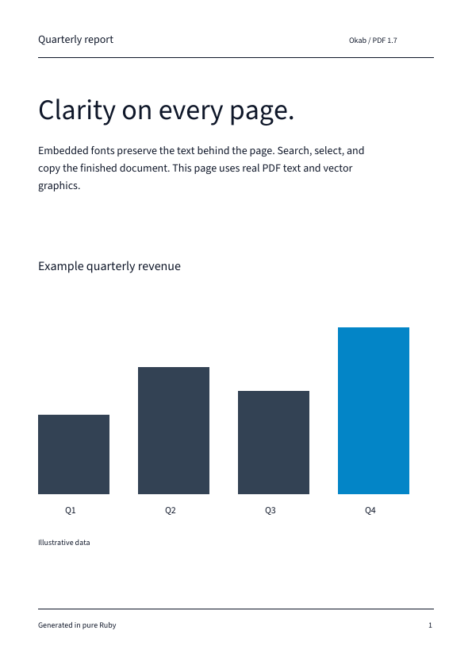

<h1 align="center">Okab</h1>

<p align="center">
  <strong>Generate searchable PDFs with embedded fonts in pure Ruby.</strong>
</p>

<p align="center">
  <a href="https://rubygems.org/gems/okab"></a>
  <a href="https://rubygems.org/gems/okab"></a>
  <a href="https://github.com/noxdea/okab/actions/workflows/main.yml"></a>
  <a href="okab.gemspec"></a>
  <a href="LICENSE.txt"></a>
</p>

<p align="center">
  <a href="https://noxdea.github.io/okab/">Website</a> ·
  <a href="https://noxdea.github.io/okab/docs/">User Guide</a> ·
  <a href="#features">Features</a> ·
  <a href="#installation">Installation</a> ·
  <a href="#quick-start">Quick start</a>
</p>

---

Okab is a small Ruby library for generating PDF 1.7 documents. It embeds font
subsets through [Alhena](https://github.com/noxdea/alhena) and writes `ToUnicode`
mappings so text remains searchable and copyable. The same document inputs
produce stable output without timestamps. Its name comes from Arabic *ʿuqāb*,
“eagle” (ζ Aquilae).

[](https://noxdea.github.io/okab/docs/media/report.pdf)

## Features

- TrueType and supported static CFF1 font embedding, including Japanese text when the font contains the glyphs
- Text and wrapped text, vector paths, clipping, transforms, and opacity
- PNG images with alpha and JPEG images embedded without re-encoding
- Optional Zaniah vector-document bridge with searchable glyph runs
- Page links, document outlines, and deterministic PDF output

## Installation

```sh
gem install okab
```

Okab requires Ruby 3.2 or newer. RubyGems installs Alhena 0.3.x and BigDecimal
as dependencies. With Bundler, add `gem "okab"` to your Gemfile.

## Quick start

Supply a TrueType or supported static CFF1 font containing the text you want
to render. Replace the font path below with a real file:

```ruby
require "okab"

font = Okab::Font.load("/path/to/font.ttf")
document = Okab::Document.new(title: "Quarterly report")
page = document.page(width: 595, height: 842) # PDF points
page.text("Quarterly report", x: 48, y: 790, font: font, size: 24)
page.text_block("A searchable report with embedded fonts.",
  x: 48, y: 750, width: 360, font: font, size: 12, line_height: 18)
document.outline("Report", page: page)
document.write("report.pdf")
```

Coordinates are in PDF points, with the origin at the lower-left corner. Text
must be valid UTF-8. Use a font with Japanese glyphs to render Japanese text.
See the [getting started guide](https://noxdea.github.io/okab/docs/) for page
sizes and text placement, or run [the report example](examples/report.rb).

### Zaniah vector documents

Install Zaniah separately, then load the optional bridge explicitly. Given an
existing `Zaniah::Vector::Document` named `vector`:

```ruby
require "okab/zaniah_vector"

pdf = Okab::Document.new
page = pdf.page(width: vector.width, height: vector.height)
Okab::ZaniahVector.draw(page, vector)
pdf.write("slide.pdf")
```

The bridge converts Zaniah's top-left coordinates to PDF's lower-left
coordinates. Solid quads and paths remain PDF vector operations, shaped glyph
IDs are embedded with `ToUnicode` mappings, and images remain PDF images.
Unsupported paint effects such as multi-stop gradients and shadows are
rasterized individually, never as a full-page screenshot. See
[the adapter guide](https://noxdea.github.io/okab/docs/zaniah-vector.html) for the
mapping and limits.

## Limits

Okab generates PDFs; it does not read or edit them. Encryption, signatures,
forms, and PDF/A are out of scope.

- CFF2, variable CFF1, and already CID-keyed CFF fonts are unsupported. CFF embedding requires `subset: true`.
- PNG input must be non-interlaced and 8-bit.
- JPEG input must be 8-bit grayscale or RGB, using baseline, extended-sequential, or progressive encoding. Exif orientation is not applied.
- Text wrapping does not add pages automatically. Direct text placement does not perform complex-script shaping; supply shaped glyphs through `Page#glyph` or the Zaniah bridge when needed.

## Documentation

- [User Guide](https://noxdea.github.io/okab/docs/)
- [Text, fonts, links, and outlines](https://noxdea.github.io/okab/docs/usage.html)
- [Graphics and images](https://noxdea.github.io/okab/docs/graphics.html)
- [Zaniah vector documents](https://noxdea.github.io/okab/docs/zaniah-vector.html)
- [Supported formats and limits](https://noxdea.github.io/okab/docs/limits.html)
- [Development and documentation](https://noxdea.github.io/okab/docs/development.html)
- [Changelog](CHANGELOG.md)

The guide sources live in [docs/](docs/). For a source checkout, run
`bundle install` followed by `bundle exec rake`.

## License

Okab is released under the [MIT License](LICENSE.txt).
